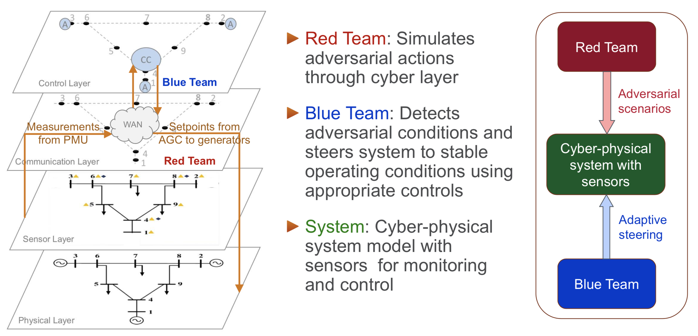
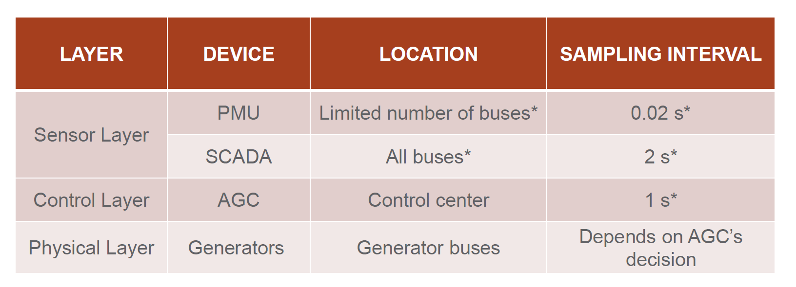
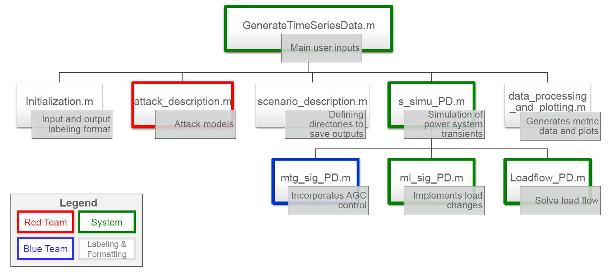

# GridSTAGE 

GridSTAGE (Spatio-Temporal Adversarial scenario GEneration) is a multivariate spatio-temporal data generation framework for simulation of adversarial scenarios in cyber-physical systems.

A thorough assessment of the impact of adversarial scenarios in the power grid and  their timely detection are critical for determining the appropriate response and steering the system back to safety.  Attacks on measurements from sensors such as Phasor Measurement Units (PMUs) or on control signals from  Automatic-Generation-Control (AGC) can mislead power system operators into taking wrong control actions and, therefore, lead to catastrophic failures.  

## **Description of Simulation Framework**

We are developing a simulation framework called "GridSTAGE (<u>Grid</u>: <u>S</u>patio <u>T</u>emporal <u>A</u>dversarial Scenario <u>GE</u>neration framework)" that models the cyber-physical system of the power grid, simulates adversarial scenarios in the system and generates multi-variate, spatio-temporal network data.  This data can be used to train ML models for anomaly detection, control or development of visualization tools.  Our framework supports simulation of attacks such as ramp, step, random, time-delay and packet-loss on PMU data.  Find an overview of this simulation framework in the presentation [GridSTAGE: SpatioTemporal Adversarial Scenario Generation framework](docs/Powerdrone_eML_2020Apr_v1.pdf).



* **Requirements:**

  * You need to have MATLAB installed in your machine.
  * Download Power System Toolbox (PST) and save files in the sub-directory 'Matlab_PST'. If you select a different name then the pathname needs to be updated in the code accordingly.
  * Download the codes 'GenerateTimeSeriesData.m', and the sub-directory 'Supporting Files'.

* **Description**:

  This collection of codes are provided for performing time-domain non-linear simulations on IEEE bus systems and generating simulated data of power systems using Matlab and PST. One can create different event scenarios by enabling or disabling any of the following - faults, AGC control, PSS control, exciter control, and different types of cyber-attacks. IEEE bus system topologies and data are used for defining the power system environment. Sensors in the power system include both PMU and SCADA, and simulated data will be generated for both of these sensors.

  

* **Simulation Workflow:**

  The following files are of the most importance when modifying the code base:
  i.    GenerateTimeSeriesData.m
  ii.   attack_description.m
  iii.  Initialization.m
  iv.   scenario_description.m
  v.    s_simu_PD.m
  vi.   mtg_sig_PD.m
  vii.  ml_sig_PD.m
  viii. loadflow_PD.m
  ix.   data16m_PD.m [This is the data file for IEEE 68 bus system]

  

  The PST setup uses numerous other files which typically do not need modification. However for making specific modifications to the system configuration they may need to be adapted.

* **Main Parameters:**

  The code provides parameters to enable or disable or configure the following conditions in the system:

  1. Load changes
  2. AGC control
     AGC control code developed by Jiangmeng Zhang and Alejandro Dominguez-Garcia (ELectrical and Computer Engineering, University of Illinois Urbana Champaign) has been integrated and adapted for our purpose.
     AGC controller uses PMU data to determine the Area Control Error (ACE). 
     ACE value is used to determine the setpoints of all the generators in the system.
  3. Cyber-attacks on PMU sensors
     We consider that PMU data is carried in packets from the PMU  to  the  control  center,  via  a  number  of  intermediate routers,  communication  links.  
     An  adversary  compromises  one  or  more  of  these mentioned  nodes  or  links  in  the  network  and  can introduce four different types of attacks.
     - Ramp
     - Step
     - Latency
     - Packet drop
     - Random
  4. Power System Stabilizer (PSS) control. 

* **Instructions for Running Simulations:**

  Run the matlab code 'GenerateTimeSeriesData.m' after choosing the user-defined parameters. 

## **User-Defined Inputs:**

  1. SavePlots
  2. Network: Choose the IEEE bus system: '9', '39', '68', '145' [AGC is currently tuned for IEEE 68 bus system. For other bus systems, AGC needs to be tuned.]
  3. agc_control : Indicate if AG control is enabled; '1' enables AGC control; '0' disables AGC control
  4. agc_time_step : Time interval in seconds between consecutive AGC control actions
  5. pss_control : Indicate if PSS control is enabled; '1' enables AGC control; '0' disables AGC control [This will also enable exciter control]
  6. num_area: The code can be run where AGC control is implemented assuming the network to have one or two distinct areas; '1' selects one area setup and '2' selects two area setup
  7. load_changes: Indicate if there are load changes; '1' enables load changes while '0' disables load changes
  8. TimeStep_of_simulation: Time step for simulation
  9. SimulationTime: Total simulation time 
  10. PMU_SamplingFreq: Reporting rate for all PMUs in the system i.e. number of samples reported every second.
      Please provide a consistent time step - this helps in saving the data as PMU measurements or SCADA measurements 
  11. PMU_attack: Indicate if there is any cyber-attack on PMU; '1' enables cyber-attacks on PMUs; '0' disables cyber-attacks on PMUs
  12. AT: Select the type of cyber-attack to be implemented in the simulation run
       1. AttackTypes{1}: 'Latency' attack (additional delays introduced  in PMU packet latencies)
       2. AttackTypes{2}: 'PacketDrop' attack (unauthorized  dropping  of  PMU packets)
       3. AttackTypes{3}: 'Ramp' attack (PMU measurement gradually modified over attack period
       4. AttackTypes{4}: 'Step' attack (PMU measurement scaled based on scaling factor)
       5. AttackTypes{5}: 'Poisoning' attack (PMU measurement are randomly corrupted by noise)
  13. n_attack_scenarios: Number of scenarios with cyber-attacks to simulate
  14. n_fault_locations: Number of fault scenarios (data with respect to each fault location will be saved as a single scenario)
  15. n_fault_type: Number of fault-types (data with respect to each fault type will be saved as a single scenario)
      The event details are provided in the (matrix) variable 'sw_con' Details about the entries of 'sw_con' are provided as comments in GenerateTimeSeriesData.m
   16. attack_magnitude_percent: Array of attack magnitudes in percentages; each value of attack magnitude in percent is implemented in a separated simulation in the form of a batch run 
   17. n_attacks_on_magnitude: Number of elements of the attack_magnitude_percent array to be simulated in batch run
   18. attack.start_time_in_sec: Simulation time when the cyber-attack is initiated
   19. attack.duration_in_sec: Duration during the simulation time when cyber-attack is active; for creating several different time windows  
   20. n_lc_scenarios: Number of scenarios with load changes 
   21. n_lc_events_per_scenario: Number of load changes in single scenario 
   22. n_loads_to_change: Number of load buses where load power is varied (Can be a pre-defined number of loads or can be a random number)
   23. load_change_parameters.start_time: Give the start times for the load changes
   24. load_change_parameters.end_time: Give the end times for the load changes (this variable can be empty which indicates the load changes are permanent-until the end of the simulation)
   25. AttackLocation: buses that are to be attacked (number and location of buses can be randomly generated for batch runs) 
      PMU sensor locations are mentioned in the data file under the variable 'fmeas_con'.
      SCADA sensor locations are mentioned in the variable 'Vmeas_con'. Required_SCADA_sampling_rate specifies the sampling rate needed for SCADA measurements (typically number of samples every 4 seconds)  
   26. Attack Characteristics for each of the attacks can be adjusted in the files attack_description.m and AttackAction.m

## **Outputs:**

  1. Time-series data corresponding to the entire network and with respect to an event can be generated based on nonlinear time-domain simulations. 
  2. Based on the specified PMU locations, synthesized PMU data is created and stored appropriately into the scenario folder under the 'Results' directory (each batch run creates a separate Scenario# folder).  
  3. Each Scenario information is also stored in a separate text file (ScenarioDescription.txt) and CSV file (ScenarioDescription.csv) inside the Scenario folder itself. 

## **Output Data files: (.mat files)**
  
  **PMUData.mat:**
  Voltage magnitudes and angles, current magnitude and angles, frequency and frequency rate at bus where PMU is located. 
  'fmeas_con' specified in the data file contains the PMU locations. PMU data is collected at high frequency rate. 
  Time step of the simulation and attack locations are also stored under the PMUData. 

  Data Organization: PMU data is stored with respect to the specified time windows (user can choose the number of time windows and it is assumed that the length of each time window is same ) 

  ```
            Vm: [3000×68 double] -- voltage magnitudes (pu)
            Va: [3000×68 double] -- voltage angles (degrees)
             f: [3000×68 double] -- frequency (Hz)
          fdot: [2999×68 double] -- frequency rate (Hz/sec)
            Im: {1×68 cell}      -- current magnitudes (in lines connecting bus i)
            Ia: {1×68 cell}      -- current angles (in lines connecting bus i)
            Id: {1×68 cell}      -- contains the description about branches connecting the bus i
    TimeStamps: [3000×1 double]  -- time stamps for the data 
    
              fmeas_con          -- PMU sensor locations      
  ```

  **SCADAData.mat:**
  Real, reactive power and voltage magnitude at a reporting rate of once every 2 sec or the time window specified by the user. 
  'Vmeas_con' specified in the data file contains the SCADA locations. 
  
  Data Organization: 
  
  ```
             Vm: [3000×68 double] -- voltage magnitudes (pu)
              P: {1×68 cell}      -- real powers (in lines connecting bus i)
              Q: {1×68 cell}      -- reactive powers (in lines connecting bus i)
              d: {1×68 cell}      -- contains the description about branches connecting the bus i
              
               Vmeas_con          -- SCADA sensor locations
  ```
  
   **ACEData.mat:**
   This data file consists of area control errors and the turbine governore setpoints at every time step
   
   ```
                  ACE_data.myACE1  -- Area control error for area-1
                  ACE_data.myACE2  -- Area control error for area-2
                       ACE_data.k  -- discrete time step indicating the time step at which where AGC has acted 
                           tg_sig  -- turbine governor setpoints                       
   ```
   
   **Pre-generated datasets:**
   
   Several scenarios corresponding to attacks and load changes for the IEEE 68 bus system can be found in /code/Results/IEEE68busSystem/
      

## **Citation**

As our simulation framework is based on PST and the AGC code developed by Jiangmeng Zhang, please refer to the following works:
1. Joe H. Chow, and Kwok W. Cheung. "A toolbox for power system dynamics and control engineering education and research." IEEE transactions on Power Systems 7, no. 4 (1992): 1559-1564.
2. Jiangmeng Zhang, and Alejandro D. Domínguez-García. "Augmenting the power system toolbox: Enabling automatic generation control and providing a platform for cyber security analysis." In 2016 North American Power Symposium (NAPS), pp. 1-5. IEEE, 2016.

```
@article{nandanoori2020model,
  title={Model-Agnostic Algorithm for Real-Time Attack Identification in Power Grid using Koopman Modes},
  author={Nandanoori, Sai Pushpak and Kundu, Soumya and Pal, Seemita and Agarwal, Khushbu and Choudhury, Sutanay},
  journal={IEEE International Conference on Communications, Control, and Computing Technologies for Smart Grids.},
  year={2020}
}

 
```
