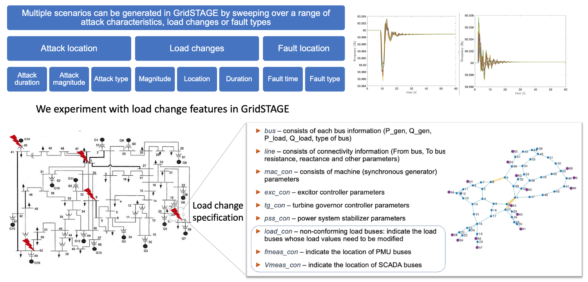

# A Benchmark Dataset for Power Grid State Prediction

## Methodology 

We are generating a set of scenarios that capture the evolution of PMU measurements in a IEEE-68 bus system under varying load change configurations.  Each scenario produces a time-series dataset with 1500 time-steps, each time-step corresponding to 0.02s (to match PMU sample rate).  Each scenario is also defined as a function of the following parameters:
* Proximity to generators - we systematically choose loads that are 1, 2 or 3 hops away from generators with varying characteristics.  Selected loads are varied in terms of their connectivity (measured by degree in the network), distance from generators as measured by hops in the graph, capacity of the generator (low vs. high).
* The amount of perturbation to the load profile (as specified by the IEEE-68 bus system) is controlled in two ways.  We sample the perturbation amount from a normal distribution with increasing standard deviation. The amount of change to the load profile is also measured in terms of the number of buses affected, as well as their relative position in one of the two-area IEEE-68 bus system.

## Dataset

The benchmark is still under development.  
* The specification of the scenarios can be accessed [here](ScenarioGeneration.csv).
* The dataset is available for download [here](https://drive.google.com/file/d/1b-Bo5ifUjmbeJw8iXK0LiXVsAKc6pLpI/view?usp=sharing).

## Data Generation

